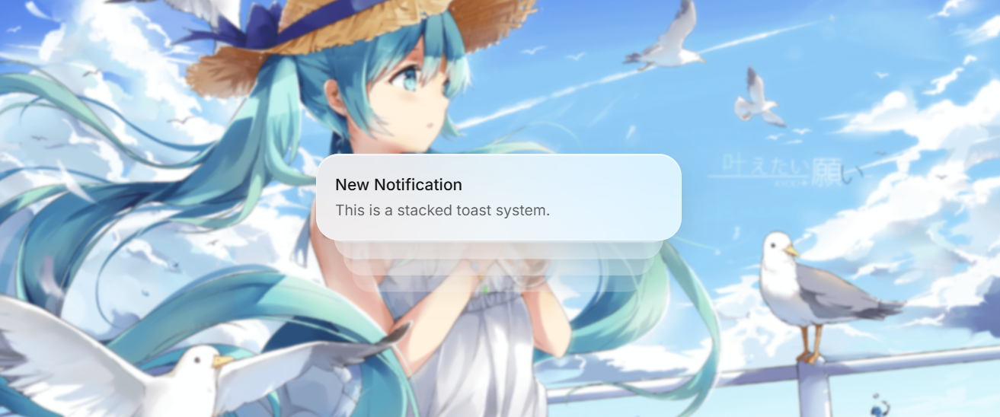

A beautiful, highly customizable, and accessible toast notification system for React. Built with Framer Motion and Tailwind CSS.

## Features

- Multiple Themes: macOS Glass, Neo-brutalism, Minimal, Soft, Ocean, Warm, and Default Glass.
- Dark Mode: Full dark mode support for all themes.
- Animations: Smooth, physics-based animations using Framer Motion (Slide, Pop, Fade).
- Stacked Design: Elegant stacking behavior that expands smoothly on hover.
- Positioning: 6 different placement options (Top/Bottom + Left/Center/Right).
- Copy & Paste: No npm package bloat. Own your code, just like shadcn/ui.

## Installation

**1. Install dependencies**

```bash
npm install motion lucide-react
```

**2. Copy the component**

Copy the consolidated source code from the documentation site and save it to your project, for example `src/components/toast.tsx`.

## Usage

Add the `<Toaster />` component to your root layout or app component:

```tsx
import { Toaster, toast } from './components/toast';

export default function App() {
  return (
    <>
      <Toaster position="top-right" theme="macos" />
      <button onClick={() => toast.success('Payment successful!')}>
        Show Toast
      </button>
    </>
  );
}
```

## API Reference

```ts
// Basic
toast('Event has been created');

// Success
toast.success('Successfully saved!');

// Error
toast.error('Something went wrong.');

// Loading
toast.loading('Saving changes...');

// Promise
toast.promise(saveSettings(), {
  loading: 'Saving...',
  success: 'Settings saved!',
  error: 'Could not save.'
});

// Custom Duration (default is 4000ms)
toast('Auto close in 5s', { duration: 5000 });

// Action Button
toast('Update available', {
  action: {
    label: 'Update',
    onClick: () => console.log('Updating...')
  }
});
```

## License

MIT
